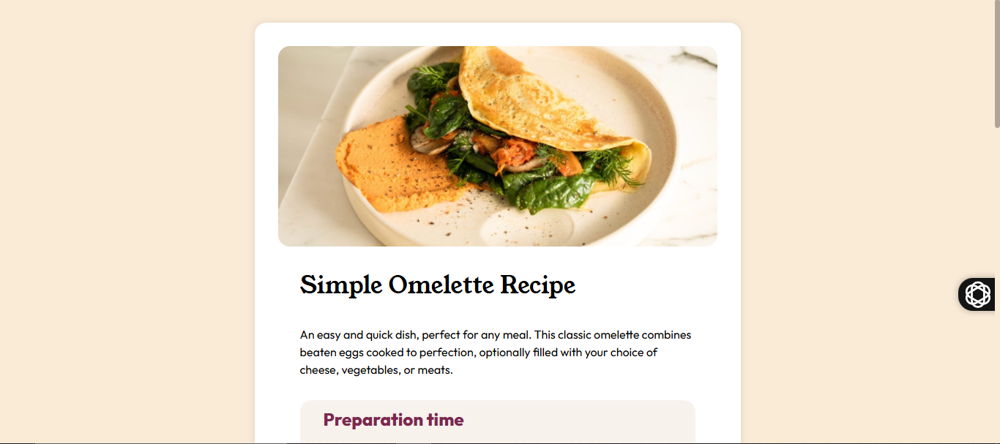

# Frontend Mentor - Recipe Page Solution

This is a solution to the [Recipe page challenge on Frontend Mentor](https://www.frontendmentor.io/challenges/recipe-page-KiTsR8QQKm). Frontend Mentor challenges help you improve your coding skills by building realistic projects.


## 🔍 Overview

This is a simple and responsive recipe website for an omelette dish, made using only HTML and CSS. It includes sections for ingredients, steps, and time needed. The layout adjusts to different screen sizes for a better user experience.


### 📷 Screenshot




### 🔗 Links

- **Solution URL**: [Frontend Mentor](https://www.frontendmentor.io/solutions/responsive-css-by-media-query-d4ZDJ5h7PT)
- **Live Site URL**: [Live Demo](https://yasminabdelhalim.github.io/Recipe-challenge/)
h
---

## 🧠 My Process

### ✅ Built With

- Semantic **HTML5** markup  
- **CSS Custom Properties**  
- **Mobile-first workflow**

---

### 📘 What I Learned

While building this recipe page, I gained hands-on experience with:

- Structuring clean, semantic HTML.
- Implementing mobile-first responsive design techniques.
- Working with typography and spacing for visual clarity.

Here’s a small snippet I used for responsive images:

```css
img{
  display:block;
  width: 100% ;
}
````

---

### 🚀 Continued Development

In future projects, I plan to:

* Use **CSS Grid** more often for advanced layouts.
* Improve **accessibility** using ARIA attributes.
* Dive deeper into **component-based design systems**.

---

### 📚 Useful Resources

* [MDN - Responsive Design](https://developer.mozilla.org/en-US/docs/Learn/CSS/CSS_layout/Responsive_Design)
* [CSS Flexbox Guide](https://css-tricks.com/snippets/css/a-guide-to-flexbox/)
* [Frontend Mentor Community](https://www.frontendmentor.io/community)

---

## 👩‍💻 Author

* **Frontend Mentor** – [@YasminAbdelhalim](https://www.frontendmentor.io/profile/YasminAbdelhalim)
* **Twitter** – [@YasminAbdelhlim](https://x.com/YasminAbdelhlim)
